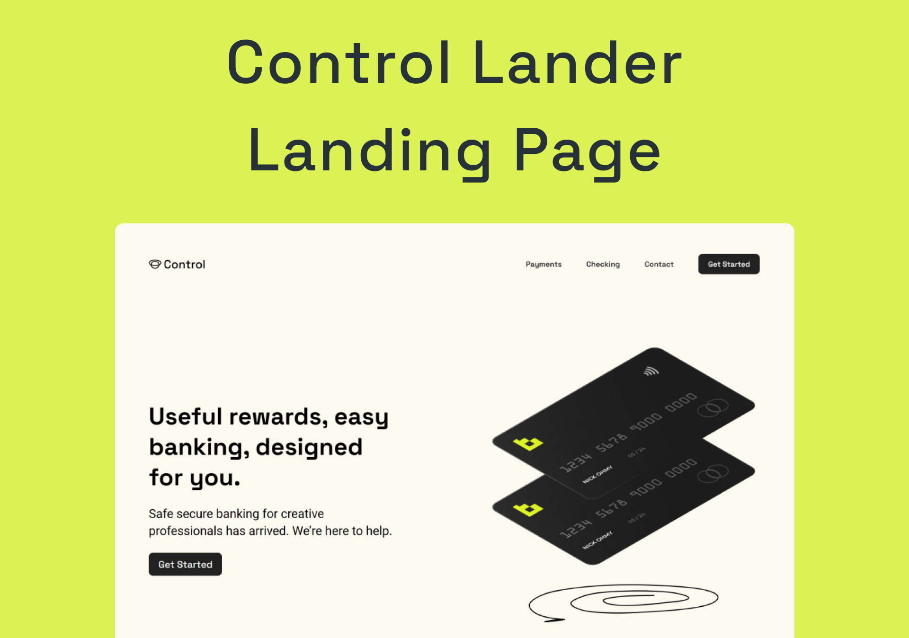

<h1 align="center">💠 Control Lander</h1>

  <strong>Landing Page realizada como forma de estudo</strong>
   

  

### Site 💻

- [Control Lander](https://control-landing-page.netlify.app/)

## Linguagens: 🚀
- HTML
- CSS
- JavaScript
